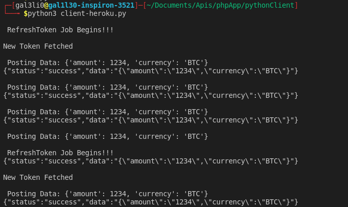

# Patricia-Code-Test

Patricia-Code-Test is my attempt at solving Patricia Coding Test. This is a basic test of making and handling POST requests on edge and embedded devices.


Instance of the Code Running.

## Basic Explanation

This codebase implements several concept involved in a fast, efficient and safe POST request in a basic embedded systems setting. It includes a system of recurring authentications with refresh token feature to reduce to surface of any attack that might otherwise invoked on the system. The basic features include

- Basic Authentication of Device Using Unique identifier
- Use of Refresh Token for re-Authorization
- Multi-Threaded Cronjob-Like Client Task Execution.

## Getting Started Quickly

_I am assuming that you don't want to have to do setup anything, simply follow the instruction. This client communicates with a hosted instance of the server on HEROKU._

To run this code, you need `pip`(Python3) installed on your PC for installing [requests](https://requests.readthedocs.io/en/master/user/install/).

Run the following code to get started.

```bash
git clone https://github.com/teezzan/Patricia-Code-Test.git
cd Patricia-Code-Test
python3 -m pip install requests
python3 ./pythonClient/client-heroku.py

```

You might have to install [requests](https://requests.readthedocs.io/en/master/user/install/) with root privileges.

## Getting Started At Normal Speed...

To run this code, you require only `composer` and `pip`(Python3) installed on your PC.

Clone this repository and install the required dependencies using [composer](https://getcomposer.org/doc/00-intro.md) and [pip](https://pip.pypa.io/en/stable/) respectively.

### Pull Git Repository.

```bash
mkdir AwesomeCandidateSubmission
cd AwesomeCandidateSubmission
git clone https://github.com/teezzan/Patricia-Code-Test.git
cd Patricia-Code-Test

```

### Install Dependencies.

Use the package manager [pip](https://pip.pypa.io/en/stable/) to install requests.

```bash
python3 -m pip install requests
```

You will also need to install the needed PHP dependencies by typing the following(assuming that you are in `Patricia-Code-Test` directory)

```bash
cd server
composer install
```

You are set.

### Run Server

This can be done with the following commands from the `Patricia-Code-Test/server` directory.

```bash
php -S localhost:8000
```

### Run Client

This should be done from a separate Terminal Instance. Simply run
the following from the `Patricia-Code-Test/pythonClient` directory.

```bash
python client.py
#or depending on your Machine
python3 client.py
```

and if you want to use the heroku server instance instead, run

```bash
python client-heroku.py
#or depending on your Machine
python3 client-heroku.py
```

## License

[MIT](https://choosealicense.com/licenses/mit/)
